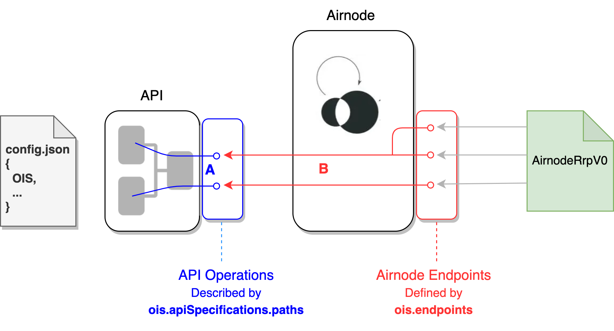

<TitleSpan>OIS</TitleSpan>

# {{$frontmatter.title}}

<VersionWarning/>

<TocHeader /> <TOC class="table-of-contents" :include-level="[2,3]" />

OIS（或称预言机集成规范-Oracle Integration Specifications）是一个JSON对象，它描述了一个API规范，并定义了与API操作相联系的 Airnode 终端节点( Endpoints）。 它是定义Airnode的 `config.json` 文件中的五个根级别对象之一。

- chains
- nodeSettings
- triggers
- ois
- apiCredentials

关于config.json文件的更多信息，请参见Airnode文档集的[部署文件](/airnode/v0.5/reference/deployment-files/config-json.md)部分。

在下面的图表中，Airnode 将其终端节点暴露在链上合约 AirnodeRrp.sol 中。 Airnode使用OIS对象将其终端节点映射到一次 API 操作。 应该注意的是，Airnode 可以有一个以上的节点对应到同一个 API 操作。

> 
> 
> - <p class="diagram-line" style="color:blue;">A) <b>ois.apiSpecifications.path</b> - 描述API操作。</p>
> - <p class="diagram-line" style="color:red;margin-top:10px;">B)<b> ois.endpoints -  </b>定义 Airnode 终端节点。</p>
     <p class="diagram-line" style="color:gray;margin-top:10px;">Airnode 终端节点和 API 操作之间存在着关系。</p>

## API 映射实例

下面是三个可能的 Airnode 到 API 操作映射例子。 映射的细节在下一个文档 [规范细节](./ois.md) 中有更好地记载。

### 简版 Airnode 终端节点

一个API有一个简单的操作，返回链上令牌的当前值 `GET /token/{id}`，并将`id`作为其唯一参数。 这里的 Airnode 终端节点将只会模仿 API 操作。 要这样做，Airnode 得声明它的终端节点有一个参数，`id`。 Airnode将从链上请求中剔除一个 `id` 参数，并将其值转移到API操作的路径参数中，名为 `id`。

```json
// ois.apiSpecifications (API operations)
"paths": {
    "/token/{id}": {    <─────────────┐
        "get": {        <────────────┐│
        "parameters": [              ││
            {                        ││
                "in": "path",        ││
                "name": "id"         ││
            },                       ││
            ...                      ││
        ]                            ││
    ...                              ││
}                                    ││
                                     ││
// ois.endpoints (Airnode Endpoints) ││ Mapping between API operations and Airnode endpoints.
"endpoints": [                       ││
    {                                ││
        "name": "tokenValue",        ││
        "operation": {               ││
            "method": "get",      <──┘│
            "path": "/token/{id}" <───┘
        },
        ...
        "parameters": [
            {
                "name": "token",
                "operationParameter": {
                    "in": "path",
                    "name": "id"
                }
    ...
]
```

### 固定操作参数的 Airnode 终端节点

一个API可能有一个操作，以摘要或细节的形式返回一个加密货币。 API操作有两个参数，一个是在路径中的 `coinId`，另一个是在query里的 `includeDetails`。 Airnode 默认只返回摘要，不返回币的细节。 因此，Airnode 将要求请求者传参数 `coinId`，如果传了的话就会忽略参数 `includeDetails`。 Airnode 将始终把 `includeDetails` 查询参数设置为false，而不管请求者在调用API操作时发送了什么。 当调用 API 操作时，它会使用 `fixedOperationParameters`。

### 两个Airnode 终端节点 - 单API操作

一个Airnode可能希望创建两个 Airnode 节点映射到一个API 操作，而请求者并不传递任何参数。 虽然 API 操作根据路径参数 `id` 返回任何令牌值，但 Airnode 只允许每个 Airnode 终端节点有一个特定令牌。 多个令牌是使用 `fixedOOperationParameters` 而不是普通的 `parameters` 来完成的。 通过将 `value` 应用于每个Airnode终端节点的 `fixedOOperationParameters`，只有该 `value` 中的token可以返回给请求者。

```json
"endpoints": [
    {
        "name": "tokenValueAPI3", // API3 token
        "operation": {
            "method": "get",
            "path": "/token/{id}"
        },
        ...
        "fixedOperationParameters": [
            {
                "name": "token",
                "operationParameter": {
                    "in": "path",
                    "name": "id"
                },
                "value":"API#"
    ...
    },
    {
        "name": "tokenValueMATIC", // MATIC token
        "operation": {
            "method": "get",
            "path": "/token/{id}"
        },
        ...
        "fixedOperationParameters": [
            {
                "name": "token",
                "operationParameter": {
                    "in": "path",
                    "name": "id"
                }
                "value":"MATIC"
    ...
    },
]
```
