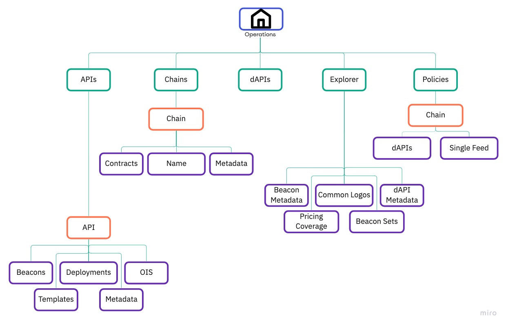

<TitleSpan>{{$frontmatter.folder}}</TitleSpan>

# {{$frontmatter.title}}

<!--TocHeader />
<TOC class="table-of-contents" :include-level="[2,3]" /-->

The [Operations repository](https://github.com/api3dao/operations) is a resource
that enables API3 to deliver beacons and dAPIs.

Operations principally consists of the following components:

- [Information about beacon-driving API providers including](https://github.com/api3dao/operations/tree/main/data/apis/amberdata)
  - [metadata pertaining to them](https://github.com/api3dao/operations/blob/main/data/apis/amberdata/apiMetadata.json)
    (name, description, icon, etc)
  - [OIS(es) describing the API provider's API](https://github.com/api3dao/operations/tree/main/data/apis/amberdata/ois)
  - [templates that back beacons](https://github.com/api3dao/operations/tree/main/data/apis/amberdata/templates)
  - [beacons and their configuration](https://github.com/api3dao/operations/tree/main/data/apis/amberdata/beacons)
  - top-up wallets for those beacons
  - [Airseeker, Airkeeper and Airnode configuration for beacon services.](https://github.com/api3dao/operations/tree/main/data/apis/amberdata/deployments)
- Metadata around on-chain services including
  - [policies and read access rights for beacons](https://github.com/api3dao/operations/tree/main/data/policies)
  - [dAPI name to beacon mappings](https://github.com/api3dao/operations/tree/main/data/dapis)
  - [DapiServer contract addresses and ABIs](https://github.com/api3dao/operations/blob/main/data/chains/avalanche.json)
- Metadata related to the display and user-related representation of beacons and
  dAPIs, particularly in the [API3 Market](https://market.api3.org), including
  - logos associated with the display of beacons
  - the pricing of those services
  - the category of those services
  - if the associated data feed has symbols associated with it, e.g. '$'
- Application code for parsing, validating, normalising and manipulating
  operations data

