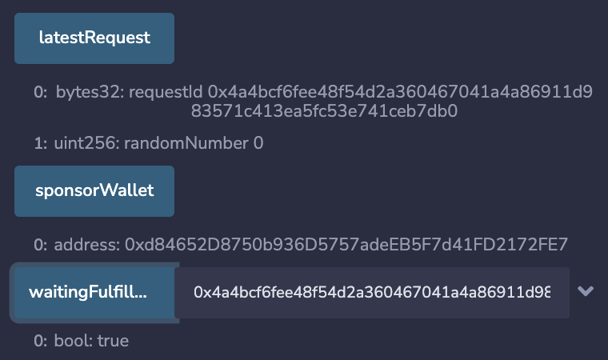
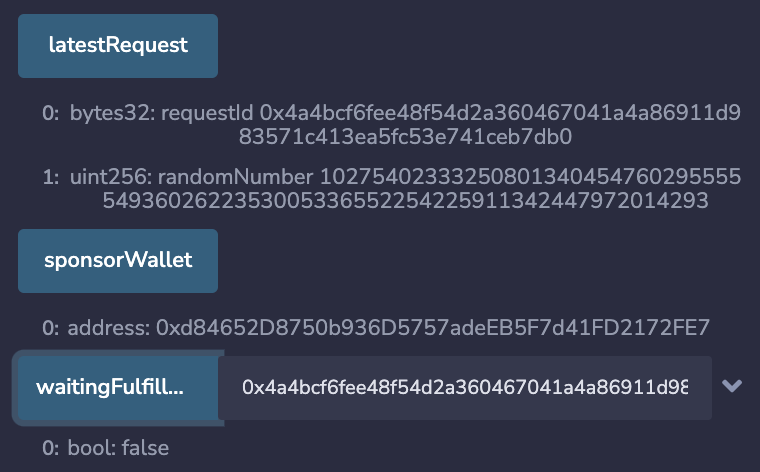

# {{$frontmatter.title}}

<TocHeader />
<TOC class="table-of-contents" :include-level="[2,3]" />

This project is a simple and quick introduction to API3's QRNG service. Simply
follow the steps to see how a simple smart contract (known as a requester) can
access an on-chain quantum random number. You will use the browser based Remix
IDE and MetaMask. Some basic knowledge of these two tools is assumed.

## Step 1: Add the Sample Contract

Open the [Remix online IDE](https://remix.ethereum.org) using a browser that you
have added Metamask support to. Not all browsers support
[MetaMask](https://metamask.io/download/).

Add a new file called `RemixQrngExample.sol` to a Remix workspace. You can use
an existing workspace or create a new one. Copy and paste the code from the
[RemixQrngExample.sol](../reference/remix-example.md) contract into the file.


## Step 2: Compile the Contract

Switch to the _SOLIDITY COMPILER_ tab. Select the `0.8.9` version of Solidity
from the _COMPILER_ pick list. Select the button labeled _Compile_ to compile
the `RemixQrngExample.sol` contract.

  

## Step 3: Deploy the Contract

Switch to the _DEPLOY & RUN TRANSACTIONS_ tab. Select the _ENVIRONMENT_ pick
list and switch to _Injected Web3_. Use MetaMask and switch to the desired
account and testnet for your deployment.


Be sure `RemixQrngExample - contracts/RemixQrngExample.sol` is selected in the
_CONTRACT_ pick list. Add the Airnode `_airnodeRrp` address parameter value for
the constructor into the field next to the _Deploy_ button. See the
[list of addresses](../reference/chains.md) for the testnet you are using.
Select the _Deploy_ button and approve the transaction with MetaMask.


## Step 4: Setting the Parameters

Before making a request parameters must be set. These determine which Airnode
endpoint will be called and declare the wallet used to pay the gas costs for the
response. Note that the function `setRequestParameters()` should be protected as
anyone can call it in its current state.

Expose the functions and variables of the contract using the _Deployed
Contracts_ pick list. Then expand the `setRequestParameters` function.

- `_airnode`: The airnode address
  (<CopyIcon text="0x9d3C147cA16DB954873A498e0af5852AB39139f2"/> ) of the
  desired QRNG service provider. Add its value from the
  [ANU Airnode](../reference/providers.md#airnode).

- `_endpointIdUint256`: The Airnode endpoint ID
  (<CopyIcon text="0xfb6d017bb87991b7495f563db3c8cf59ff87b09781947bb1e417006ad7f55a78"/>
  ) that will return a single random number. Add its value from the
  [ANU Airnode](../reference/providers.md#endpointiduint256).

- `_sponsorWallet`: A wallet derived from the requester's contract address, the
  Airnode address, and the Airnode xpub. Used to pay gas costs to acquire a
  random number. A sponsor wallet must be derived using the command
  [derive-sponsor-wallet-address](/airnode/v0.7/reference/packages/admin-cli.html#derive-sponsor-wallet-address)
  from the Admin CLI. Use the value of the sponsor wallet address that the
  command outputs.

  ```sh
  npx @api3/airnode-admin derive-sponsor-wallet-address \
    --airnode-xpub xpub6DXSDTZBd4aPVXnv6Q3SmnGUweFv6j24SK77W4qrSFuhGgi666awUiXakjXruUSCDQhhctVG7AQt67gMdaRAsDnDXv23bBRKsMWvRzo6kbf \
    --airnode-address 0x9d3C147cA16DB954873A498e0af5852AB39139f2 \
    --sponsor-address <use-the-address-of: RemixQrngExample.sol>

    # --airnode-xpub: Pre-filled, see the API Providers doc.
    # --airnode-address: Pre-filled, see the API Providers doc.
    # --sponsor-address: The address for RemixQrngExample.sol is displayed in the Remix IDE.

    # The command outputs.
    Sponsor wallet address: 0x6394...5906757
    # Use the above output from your command execution as the value for _sponsorWallet.
  ```

  Be sure to fund the public address of the sponsor wallet that the command
  outputs. The funds are used to pay gas costs for the Airnode's response.

Lastly select the _Transact_ button in Remix to send the parameters to the
contract to be stored. Approve the transaction with MetaMask.

<airnode-SponsorWalletWarning/>

## Step 5: Make a Request

Each request made will use the parameters set in step 4. You can change the
parameters at any time and subsequent requests will use the newer parameter set.

To make a request select the _MakeRequest..._ button in Remix. Approve the
transaction with MetaMask.

As soon as the transaction completes, select the _lastRequest_ button in Remix.
You will see the `requestId` but the `randomNumber` which equals zero. The
random number has yet too be returned to the callback function. Copy and paste
the `requestId` in the field for _waitingFulfillment_. You will see the value is
true, the callback has not been called yet.



## Step 6: View the Response

The request is gathered by the off-chain Airnode which in turn calls the QRNG
service at the API provider. Once the API provider returns data, Airnode will
callback to the `RemixQrngExample.sol` contract function
`fulfillUint256(bytes32 requestId, bytes calldata data)`.

Select the the _lastRequest_ button in Remix again. If the callback has been
successfully completed the randomNumber will be present. The value of
_waitingFulfillment_ is false


