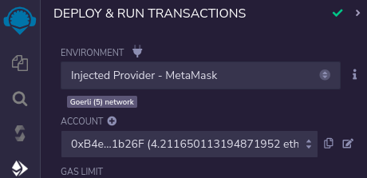

<TitleSpan>{{$frontmatter.folder}}</TitleSpan>

# {{$frontmatter.title}}

<TocHeader />
<TOC class="table-of-contents" :include-level="[2,3]" />

This project is a simple and quick introduction to API3's QRNG service. Simply
follow the steps to see how a smart contract (known as a requester) can access
an on-chain quantum random number. You will use the browser based Remix IDE and
MetaMask. Some basic knowledge of these two tools is assumed.

Remix UI components to interact with are show as:
<ElementSelect text="UI name"/> (brown) highlighted text.

## Step 1: Add the Sample Contract

Open the [Remix online IDE](https://remix.ethereum.org) using a browser that you
have added Metamask support to. Not all browsers support
[MetaMask](https://metamask.io/download/).

Add a new file called `RemixQrngExample.sol` to a Remix workspace. You can use
an existing workspace or create a new one. Copy and paste the code from the
[RemixQrngExample.sol](../reference/remix-example.md) contract into the file.


## Step 2: Compile the Contract

Switch to the <ElementSelect text="SOLIDITY COMPILER"/> tab. Select the `0.8.9`
version of Solidity from the <ElementSelect text="COMPILER"/> pick list. Select
the <ElementSelect text="Compile
RemixQrngExample.sol"/> button to compile the `RemixQrngExample.sol` contract.

  

## Step 3: Deploy the Contract

::: danger Deploy to a testnet only.

Do not deploy the `RemixQrngExample.sol` contract to a production network. It
lacks adequate security features.

:::

Switch to the <ElementSelect text="DEPLOY & RUN TRANSACTIONS"/> tab. Use
MetaMask and switch to the desired account and testnet for your deployment.
Select the <ElementSelect text="ENVIRONMENT"/> pick list and switch to _Injected
Web3_. Check that the testnet and account you selected in MetaMask are displayed
in Remix as shown below.



Be sure `RemixQrngExample - contracts/RemixQrngExample.sol` is selected in the
<ElementSelect text="CONTRACT"/> pick list. Add the Airnode `_airnodeRrp`
address parameter value for the constructor into the field next to the
<ElementSelect text="Deploy"/> button. See the
[list of addresses](../reference/chains.md) for the testnet you are using.
Select the <ElementSelect text="Deploy"/> button and approve the transaction
with MetaMask.


## Step 4: Setting the Parameters

Before making a request, parameters must be set. They determine which Airnode
endpoint will be called and define the wallet used to pay the gas costs for the
response.

Under <ElementSelect text="Deployed
Contracts"/> expand and expose the functions and variables of the contract. Note
the address of the contract that is displayed with its name. This is the
requester's contract address which will be needed later. Next expand the
<ElementSelect text="setRequestParameters"/> function. Add the following to the
corresponding fields for the function.

- `_airnode`: The airnode address (copy it here →
  <CopyIcon text="0x9d3C147cA16DB954873A498e0af5852AB39139f2"/> ) of the desired
  QRNG service provider. See its value from the
  [ANU Airnode](../reference/providers.md#airnode).

- `_endpointIdUint256`: The Airnode endpoint ID (copy it here →
  <CopyIcon text="0xfb6d017bb87991b7495f563db3c8cf59ff87b09781947bb1e417006ad7f55a78"/>
  ) that will return a single random number. See its value from the
  [ANU Airnode](../reference/providers.md#endpointiduint256).

- `_sponsorWallet`: A wallet derived from the requester's contract address, the
  Airnode address, and the Airnode xpub. The wallet is used to pay gas costs to
  acquire a random number. A sponsor wallet must be derived using the command
  [derive-sponsor-wallet-address](/airnode/v0.7/reference/packages/admin-cli.html#derive-sponsor-wallet-address)
  from the Admin CLI. Use the value of the _sponsor wallet address_ that the
  command outputs.

  ```sh
  npx @api3/airnode-admin derive-sponsor-wallet-address \
    --airnode-xpub xpub6DXSDTZBd4aPVXnv6Q3SmnGUweFv6j24SK77W4qrSFuhGgi666awUiXakjXruUSCDQhhctVG7AQt67gMdaRAsDnDXv23bBRKsMWvRzo6kbf \
    --airnode-address 0x9d3C147cA16DB954873A498e0af5852AB39139f2 \
    --sponsor-address <use-the-address-of: RemixQrngExample.sol>

    # --airnode-xpub:    Pre-filled, see https://docs.api3.org/qrng/reference/providers.html.
    # --airnode-address: Pre-filled, see https://docs.api3.org/qrng/reference/providers.html.
    # --sponsor-address: Use the requester's contract address for
    #                    RemixQrngExample.sol as displayed in the Remix IDE.

    # The command outputs.
    Sponsor wallet address: 0x6394...5906757
    # Use the above address from your command execution as the value for _sponsorWallet.
  ```

  Be sure to fund the public address of the sponsor wallet that the command
  outputs. The funds are used to pay gas costs for the Airnode's response.

Lastly select the <ElementSelect text="Transact"/> button in Remix to send the
parameters to the contract to be stored. Approve the transaction with MetaMask.

<airnode-SponsorWalletWarning/>

## Step 5: Make a Request

Be sure you have funded the sponsor wallet created in step #4. Its funds will be
used to pay gas costs when Airnode returns a random number to the callback
function `fulfillUint256()`.

Each request made will use the parameters set in step 4. You can change the
parameters at any time and subsequent requests will use the newer parameter set.

To make a request select the <ElementSelect text="MakeRequest"/> button in
Remix. Approve the transaction with MetaMask.

As soon as the transaction completes in MetaMask, select the
<ElementSelect text="lastRequest"/> button in Remix. You will see the
`requestId` and a `randomNumber` which equals _0_. This is because the random
number has yet to be returned to the callback function. Copy and paste the
`requestId` into the field for <ElementSelect text="waitingFulfillment"/> and
select the button. You will see the value is _true_, meaning the callback has
not been made.


## Step 6: View the Response

The request is gathered by the off-chain Airnode which in turn calls the API
provider. Once the API provider returns data, Airnode will callback to the
`RemixQrngExample.sol` contract function
`fulfillUint256(bytes32 requestId, bytes calldata data)`.

Select the the <ElementSelect text="lastRequest"/> button in Remix again. If the
callback has been successfully completed the randomNumber will be present. The
value of <ElementSelect text="waitingFulfillment"/> will be _false_.


