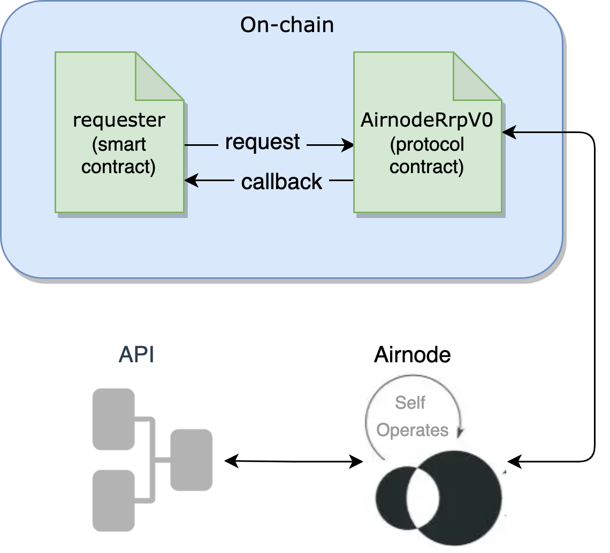

<TitleSpan>{{$frontmatter.folder}}</TitleSpan>

# {{$frontmatter.title}}

<TocHeader />
<TOC class="table-of-contents" :include-level="[2,3]" />

The API3 QRNG service is implemented using the Airnode request–response protocol
contract,
[AirnodeRrpV0](https://github.com/api3dao/airnode/blob/master/packages/airnode-protocol/contracts/rrp/AirnodeRrpV0.sol),
to acquire a random number.

Upon request, [Airnode](/airnode/v0.9/) calls a designated API operation and
acquires a random number and then delivers it on-chain, via the `AirnodeRrpV0`
protocol contract, to a requester.

In the diagram below a requester (smart contract) submits a request for a random
number to `AirnodeRrpV0`. Airnode gathers the request from the `AirnodeRrpV0`
protocol contract, gets the random number from an API operation and sends it
back to `AirnodeRrpV0`. Once received, `AirnodeRrpV0` performs a callback to the
requester with the random number.

> 

Calling `AirnodeRrpV0` for a random number is the same as any other Airnode
request. Read more about how a requester
[accesses an Airnode](/airnode/v0.9/grp-developers/) to acquire data from API
operations.

::: tip Gas Costs

Using the QRNG service is free, meaning there is no subscription fee to pay.
There is a gas cost incurred on-chain when Airnode places the random number
on-chain in response to a request, which the requester needs to pay for.

:::

## Requesters

A requester (smart contract) calls the QRNG service using the _request–response
protocol (RRP)_ implemented by the on-chain `AirnodeRrpV0` contract. The
contract
[RrpRequesterV0.sol](https://github.com/api3dao/airnode/blob/master/packages/airnode-protocol/contracts/rrp/requesters/RrpRequesterV0.sol)
is meant to be inherited by any requester that will be making requests to
AirnodeRrpV0. It is part of the NPM
[@api3/airnode-protocol](https://www.npmjs.com/package/@api3/airnode-protocol)
package.

In practice, the requester implements two functions that are specific to
_requesting_ and _receiving_ a random number from the QRNG service. Consider the
following flow (extracted from the
[QRNG example contract](https://github.com/api3dao/qrng-example/blob/main/contracts/QrngExample.sol))
to understand how to call for a random number.

1. The function `makeRequestUint256()` calls `airnodeRrp.makeFullRequest()` to
   request a random number, which in turn returns a `requestId`. The `requestId`
   is stored in the mapping `expectingRequestWithIdToBeFulfilled` for reference
   in the callback function.

2. The function `fulfillUint256` is the callback to receive the random number
   from the QRNG service. The callback contains the `requestId` returned by the
   initial request and the `data`, which contains the random number. The
   `requestId` is verified and removed from the mapping
   `expectingRequestWithIdToBeFulfilled`.

An additional pair of functions
([makeRequestUint256Array()](https://github.com/api3dao/qrng-example/blob/main/contracts/QrngExample.sol#L98-L113)
and
[fulfillUint256Array()](https://github.com/api3dao/qrng-example/blob/main/contracts/QrngExample.sol#L115-L131))
can be used to acquire an array of random numbers.
